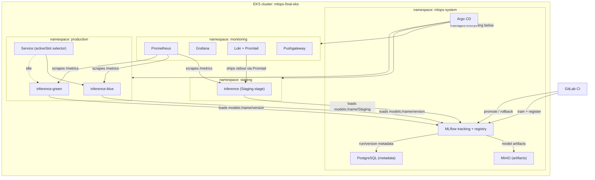

# MLOps final project - iris-classifier platform

End-to-end MLOps platform for a small Iris classifier: MLflow tracking +
Model Registry, staging/production inference with a blue-green switch,
Prometheus/Grafana/Loki observability, and a security baseline around the
inference API and the registry itself. Builds directly on top of earlier
homeworks in this course rather than starting over - see "What's reused"
below.

## Architecture



## Repository layout

```
terraform/
  vpc/          - network (reused from goit-mlops-hw-05)
  eks/          - EKS cluster, single cpu-nodes group (reused from goit-mlops-hw-05)
  argocd/       - Argo CD + ApplicationSet (reused from goit-mlops-hw-07)
  mlflow/       - Argo CD Applications: MLflow, MinIO, PostgreSQL, Pushgateway
  monitoring/   - Argo CD Applications: kube-prometheus-stack, Loki, inference dashboard
  inference/    - Argo CD Applications: inference-staging, inference-production
training/       - training pipeline, extends goit-mlops-hw-09's train_and_push.py
inference/
  app/          - FastAPI service (model_loader.py, schemas.py, main.py)
  helm/         - Helm chart for staging + blue/green production
scripts/        - promote_model.py, rollback.py, registry_audit.py
rbac/           - mlops-engineer / viewer Roles and RoleBindings
docs/           - THREAT_MODEL.md
RUNBOOK.md, ADR.md, README.md (this file)
```

The Argo CD GitOps repo is a separate repo, `goit-argo` (also reused from
earlier homeworks) - it's what the `argocd/` module's ApplicationSet
watches, though for this project every Application is created directly by
Terraform instead (see each module's `main.tf` for why).

## What's reused vs new

- `terraform/vpc`, `terraform/eks`, `terraform/argocd`: copied close to
  verbatim from `goit-mlops-hw-05` and `goit-mlops-hw-07` - same working
  code, different backend state keys (`final/...` prefix) so it doesn't
  collide with those homeworks' own state.
- `terraform/mlflow`: same MLflow/MinIO/PostgreSQL/Pushgateway setup as
  `goit-mlops-hw-09`, restructured from raw GitOps-repo YAML into Terraform-
  managed Application CRs, and re-targeted at the `mlops-system` namespace.
- `terraform/monitoring`: same kube-prometheus-stack as hw-09, plus Loki +
  Promtail (new) and the inference Grafana dashboard (new).
- `training/train_and_push.py`: same training sweep as hw-09, extended with
  Model Registry registration, git-commit/dataset-version tags, and an
  artifact checksum tag.
- Everything under `inference/`, `scripts/`, `rbac/`, `docs/`: new for this
  project.

## Dependencies

- Terraform >= 1.10, AWS provider ~> 6.0, kubernetes provider ~> 3.0, helm
  provider ~> 3.0
- AWS CLI v2, configured with an account that has EKS/VPC/IAM permissions
- kubectl, matching the cluster's Kubernetes version (1.35)
- Python 3.12 (training pipeline and inference service both target this)
- Docker, to build the `inference/Dockerfile` image and push it somewhere
  the cluster can pull from (ECR, most likely - see `image.repository` in
  `inference/helm/values-*.yaml`, currently a placeholder)

## Deploying from scratch

Bootstrap happens in phases - later modules read state or depend on
resources the earlier ones create, so they can't all `apply` at once:

```
cd terraform/vpc         && terraform init && terraform apply
cd terraform/eks         && terraform init && terraform apply
cd terraform/argocd
terraform init
terraform apply -target=helm_release.argocd   # ApplicationSet CRD doesn't exist yet otherwise
terraform apply                                # now the ApplicationSet itself
cd terraform/mlflow      && terraform init && terraform apply
cd terraform/monitoring  && terraform init && terraform apply
cd terraform/inference   && terraform init && terraform apply
```

Then, outside Terraform (this is cluster bootstrap, not an application
workload - see `rbac/README.md` for why it's not run through Argo CD):

```
kubectl apply -f rbac/mlops-engineer-role.yaml
kubectl apply -f rbac/viewer-role.yaml
```

Check everything actually came up:

```
kubectl get applications -n mlops-system   # all should show Synced/Healthy
kubectl get pods -A
```

Access points (all ClusterIP, reached through port-forward - no public
Ingress in this project, see the note in `.gitlab-ci.yml` about why CI needs
in-cluster network access instead):

```
kubectl port-forward svc/argocd-server -n mlops-system 8080:80
kubectl port-forward svc/mlflow-tracking-tracking -n mlops-system 5000:5000
kubectl port-forward -n monitoring svc/prometheus-operator-grafana 3000:80
kubectl port-forward -n staging svc/inference 8000:80
kubectl port-forward -n production svc/inference 8000:80
```

## What's not done yet

- Block E (Evidently AI drift monitoring, alerting, escalation policy)
- Block F (pytest for the training pipeline, ruff/black/terraform fmt in CI,
  Trivy/Grype image scanning)
- Block G (all bonus items)
- The inference image hasn't been built/pushed to a real registry yet -
  `image.repository` in the Helm values is still a placeholder.
- Nothing here has actually been `terraform apply`'d against real AWS yet -
  this pass was file/code preparation only, done deliberately without
  spinning up billable infrastructure before everything was ready to go up
  at once.
