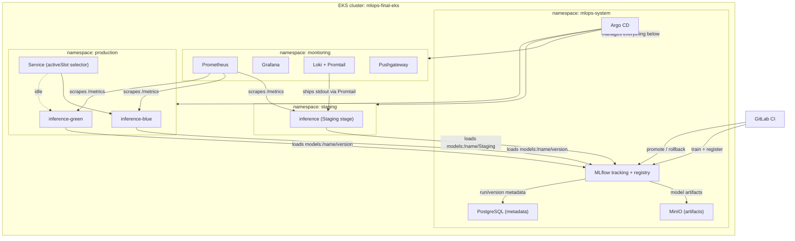

# MLOps final project - iris-classifier platform

End-to-end MLOps platform for a small Iris classifier: MLflow tracking +
Model Registry, staging/production inference with a blue-green switch,
Prometheus/Grafana/Loki observability, and a security baseline around the
inference API and the registry itself. Builds directly on top of earlier
homeworks in this course rather than starting over - see "What's reused"
below.

## Architecture



**Namespaces** (Block A2):

- `mlops-system` - Argo CD, MLflow tracking + Model Registry, MinIO
  (artifact store), PostgreSQL (MLflow metadata DB).
- `monitoring` - Prometheus, Grafana, Loki + Promtail, Pushgateway, the
  drift-check CronJob (Block E1).
- `staging` - one inference Deployment tracking MLflow's `Staging` stage
  directly (`MODEL_STAGE=Staging`) - always serves whatever was trained
  most recently, no manual pinning.
- `production` - two inference Deployments (`blue`/`green`), each pinned to
  an explicit `MODEL_VERSION`; one Service's selector picks the active
  slot (Block B3's blue-green strategy - see ADR.md for why this strategy
  was chosen over Canary/A-B).

## Repository layout

```
terraform/
  vpc/          - network (reused from goit-mlops-hw-05)
  eks/          - EKS cluster, single cpu-nodes group (reused from goit-mlops-hw-05)
  argocd/       - Argo CD + ApplicationSet (reused from goit-mlops-hw-07)
  mlflow/       - Argo CD Applications: MLflow, MinIO, PostgreSQL, Pushgateway
  monitoring/   - Argo CD Applications: kube-prometheus-stack, Loki, inference
                  dashboard, drift-check CronJob, alert rules
  inference/    - Argo CD Applications: inference-staging, inference-production
training/
  train_and_push.py, requirements.txt - extends goit-mlops-hw-09's script
  tests/        - unit + local-integration tests (Block F1)
inference/
  app/          - FastAPI service (model_loader.py, schemas.py, main.py)
  helm/         - Helm chart for staging + blue/green production
  tests/        - Pydantic schema validation tests (Block F1)
monitoring/
  drift/        - Block E1: Evidently drift-check job (its own small image)
scripts/        - promote_model.py, rollback.py, registry_audit.py
rbac/           - mlops-engineer / viewer Roles and RoleBindings
docs/           - THREAT_MODEL.md, ESCALATION_POLICY.md
pyproject.toml, .yamllint.yaml, requirements-dev.txt - Block F2 lint config
RUNBOOK.md, ADR.md, README.md (this file)
```

The Argo CD GitOps repo is a separate repo, `goit-argo` (also reused from
earlier homeworks) - it's what the `argocd/` module's ApplicationSet
watches, though for this project every Application is created directly by
Terraform instead (see each module's `main.tf` for why).

## What's reused vs new

- `terraform/vpc`, `terraform/eks`, `terraform/argocd`: copied close to
  verbatim from `goit-mlops-hw-05` and `goit-mlops-hw-07` - same working
  code, different backend state keys (`final/...` prefix) so it doesn't
  collide with those homeworks' own state.
- `terraform/mlflow`: same MLflow/MinIO/PostgreSQL/Pushgateway setup as
  `goit-mlops-hw-09`, restructured from raw GitOps-repo YAML into Terraform-
  managed Application CRs, and re-targeted at the `mlops-system` namespace.
- `terraform/monitoring`: same kube-prometheus-stack as hw-09, plus Loki +
  Promtail (new) and the inference Grafana dashboard (new).
- `training/train_and_push.py`: same training sweep as hw-09, extended with
  Model Registry registration, git-commit/dataset-version tags, and an
  artifact checksum tag.
- Everything under `inference/`, `scripts/`, `rbac/`, `docs/`: new for this
  project.

## Dependencies

- Terraform >= 1.10, AWS provider ~> 6.0, kubernetes provider ~> 3.0, helm
  provider ~> 3.0
- AWS CLI v2, configured with an account that has EKS/VPC/IAM permissions
- kubectl, matching the cluster's Kubernetes version (1.35)
- Python 3.12 (training pipeline and inference service both target this)
- Docker, to build the `inference/Dockerfile` image and push it somewhere
  the cluster can pull from - this project uses ECR, see `image.repository`
  in `inference/helm/values-*.yaml`

## Deploying from scratch

Bootstrap happens in phases - later modules read state or depend on
resources the earlier ones create, so they can't all `apply` at once:

```
cd terraform/vpc         && terraform init && terraform apply
cd terraform/eks         && terraform init && terraform apply
cd terraform/argocd
terraform init
terraform apply -target=helm_release.argocd   # ApplicationSet CRD doesn't exist yet otherwise
terraform apply                                # now the ApplicationSet itself
cd terraform/mlflow      && terraform init && terraform apply
cd terraform/monitoring  && terraform init && terraform apply
cd terraform/inference   && terraform init && terraform apply
```

Then, outside Terraform (this is cluster bootstrap, not an application
workload - see `rbac/README.md` for why it's not run through Argo CD):

```
kubectl apply -f rbac/mlops-engineer-role.yaml
kubectl apply -f rbac/viewer-role.yaml
```

Check everything actually came up:

```
kubectl get applications -n mlops-system   # all should show Synced/Healthy
kubectl get pods -A
```

Access points (all ClusterIP, reached through port-forward - no public
Ingress in this project, see the note in `.gitlab-ci.yml` about why CI needs
in-cluster network access instead):

```
kubectl port-forward svc/argocd-server -n mlops-system 8080:80
kubectl port-forward svc/mlflow-tracking-tracking -n mlops-system 5000:5000
kubectl port-forward -n monitoring svc/prometheus-operator-grafana 3000:80
kubectl port-forward -n staging svc/inference 8000:80
kubectl port-forward -n production svc/inference 8000:80
```

## CI/CD pipeline stages

`.gitlab-ci.yml` has 6 stages: `lint`, `test`, `security`, `train`, `promote`,
`rollback`. Only the first three run automatically on every push; the last
three always show up gray/"Manual" in the GitLab UI, and that's expected -
not a broken pipeline:

- **`train-model`**: needs `MLFLOW_TRACKING_URI` to resolve the cluster's
  internal DNS name (`mlflow-tracking-tracking.mlops-system.svc.cluster.local`).
  A plain GitLab SaaS shared runner has no route into this project's private
  VPC, so it can only ever be run from a runner registered inside the
  cluster - hence manual, not "on every push".
- **`promote-to-production`** / **`rollback-production`**: manual by design,
  not by network limitation. Promoting a model to production is meant to be
  a deliberate human action, never something that fires automatically just
  because training succeeded.

Both promotion and rollback have already been exercised end-to-end against
the live cluster via `scripts/promote_model.py` / `scripts/rollback.py` (see
"Verified working end-to-end" below) - just run directly, not through this
GitLab job, for the same network reason as `train-model`.

## What's not done yet

- Block G (all bonus items)

## Verified working end-to-end (not just file prep)

Everything above has actually been `terraform apply`'d, and these were
checked against the live cluster, not just read through:

- All 8 Argo CD Applications: Synced/Healthy
- `/predict` on both staging and production, including Pydantic validation
  (422 on bad input) and rate limiting (429 past 60 req/min)
- Prometheus scraping the inference service (`up{job="inference"}`,
  `http_requests_total` present)
- A full blue-green cycle: promote a new version, stand it up in the idle
  slot, flip `activeSlot`, then roll back with a single commit
- RBAC applied (`kubectl apply -f rbac/`)
- Block E's CronJob (`monitoring/drift/`) built, pushed to ECR, and running
  on schedule
- Block F's tests/lint (`training/tests/`, `inference/tests/`, `ruff`,
  `black`, `yamllint`) all passing locally

## A few things that bit me getting here

- **t3.small (2GB RAM) doesn't comfortably run this whole stack.** ArgoCD +
  MLflow + kube-prometheus-stack + Loki/Promtail + inference pushed two of
  four nodes into `NotReady` (kubelet itself stopped responding, not just
  memory pressure) the first time everything was up at once. Fixed by
  terminating the stuck EC2 instances (the managed node group's ASG replaces
  them automatically) and cutting footprint: `prometheus-node-exporter`
  disabled (a DaemonSet, so it's one pod *per node* for host metrics this
  project doesn't use - pod CPU/RAM comes from kubelet/cAdvisor instead, see
  `kubelet:` in `terraform/monitoring/main.tf`), Argo CD's `dex`/
  `notifications` disabled (unused - no SSO, no external alert receiver),
  MLflow's chart-bundled `run` deployment disabled (a demo job the chart
  ships, not something this project calls). Also requested an AWS vCPU quota
  increase (8 -> 16) as a longer-term fix, in case node count ever needs to
  grow instead of shrinking further.
- **Argo CD syncs from GitHub, not from whatever's on disk.** Forgot to push
  a couple of values changes before wondering why an Application wouldn't
  pick them up - obvious in hindsight, cost a few minutes each time.
- **`kubectl port-forward` to a Service pins to whichever pod answered
  first** and doesn't follow along when the Service's selector changes
  (exactly what a blue-green switch does). Had to kill and reopen the
  port-forward after every switch to see the new pod's response instead of
  the old one's.
- **`mlflow.artifacts.download_artifacts` nests the file under a folder
  named after the artifact path** (`dst_path/model/model.pkl`, not
  `dst_path/model.pkl`) when a `dst_path` is given. Broke the checksum
  computation in both `train_and_push.py` and `model_loader.py` the same
  way; fixed by globbing for `model.pkl` instead of hardcoding the path.
- **kube-prometheus-stack has two separate TLS toggles that look like one.**
  `prometheusOperator.admissionWebhooks` is the PrometheusRule validating
  webhook; `prometheusOperator.tls` is the operator's *own* internal
  webhook cert, and it mounts a secret that only exists if cert-manager or
  the patch job is enabled. Disabling only the first one left a pod stuck in
  `ContainerCreating` forever on a missing `prometheus-operator-admission`
  secret.
